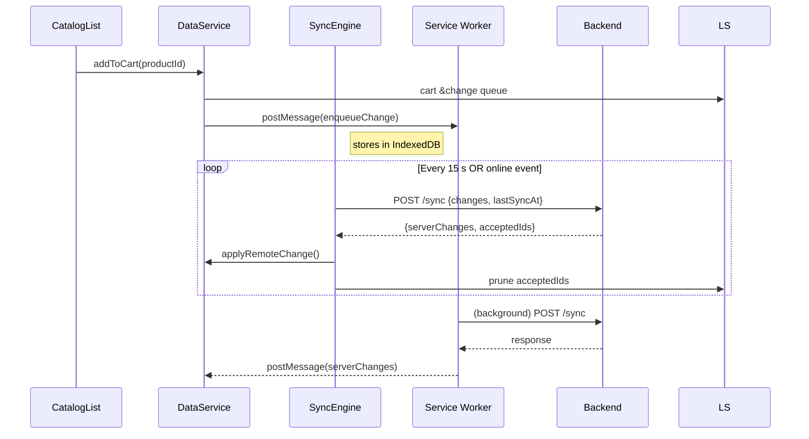
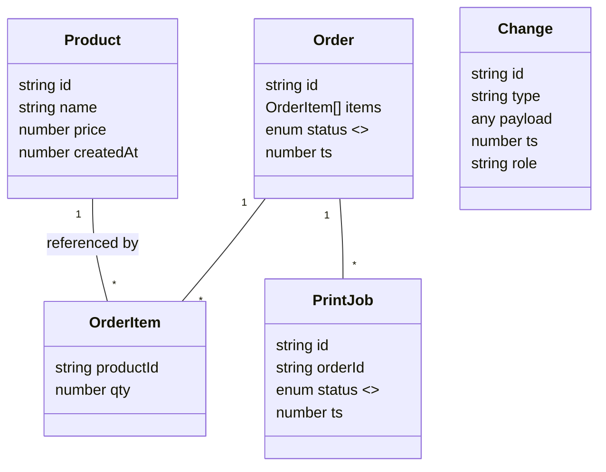

# Offline-First POS – Full System Design (RADIO Framework)

> This document complements `README.md` by adding a rigorous front-end system-design walkthrough following the **RADIO** framework – **R**equirements → **A**rchitecture → **D**ata-model → **I**nterfaces → **O**ptimisations.
>
> It also highlights the Service-Worker background-sync flow that isn’t covered in the original README.

---

## R — Requirements

### Functional

1. **Multi-Role UI** – One React PWA compiled into four roles (Cashier, Kitchen, Serving, Manager).
2. **Offline First** – All roles must work without network for hours and reconcile automatically when back online.
3. **Order Lifecycle** – Create → Prepare → Ready → Served with real-time convergence across devices.
4. **Printing** – Cashier & Kitchen can queue print jobs that survive reloads / offline.
5. **Menu Distribution** – Tablets pull menu once and cache locally for instant boot.
6. **Background Sync** – Changes generated while the tab is closed (or in the background) must still reach the server.

### Non-Functional

1. **< 150 ms TTI** on mid-range tablets.
2. **Resilience** – Survive tab crashes, device reboots, flaky networks.
3. **Simplicity** – Whole stack should stay hackable for a weekend project ⇒ avoid heavy infra.
4. **Cost** – Runs on a USD 5/mo VPS.

---

## A — Architecture

### 1. High-Level

```mermaid
flowchart LR
    subgraph Client-Side
        A[React UI (role-specific)] -- "mutations" --> DS[DataService]
        DS -- "local save" --> LS[(LocalStorage)]
        DS -- "postMessage" --> SW[Service Worker]
        SW -- "BG Sync" --> BE[/sync API]
        DS -- "subscribe" --> SE[SyncEngine]
        SE -- "15 s polling" --> BE
    end

    BE --> DB[(LowDB JSON)]
```

Legend:

- **DataService** – synchronous, in-tab data manipulation.
- **SyncEngine** – best-effort pull/push every 15 s (fallback when BG-Sync unsupported).
- **Service Worker** – stores queued changes in IndexedDB (`pos-bg-sync`) and triggers Background-Sync.
- **BE** – 90-line Express server persisting every change in LowDB and echoing deltas.

### 2. Sequence – Cashier adds an item



---

## D — Data-Model

### LocalStorage / IndexedDB Buckets (all prefixed by `ROLE`)

| Key              | Type           | Notes                                 |
| ---------------- | -------------- | ------------------------------------- |
| `_pos_products`  | `Product[]`    | Read-only menu snapshot               |
| `_pos_orders`    | `Order[]`      | Mutable, state kills conflict by `ts` |
| `_pos_changes`   | `Change[]`     | FIFO queue until server ACK           |
| `_pos_printJobs` | `PrintJob[]`   | Local print micro-queue               |
| `_pos_sync_meta` | `{lastSyncAt}` | Per-device water-mark                 |

### Core Entities (UML)



---

## I — Interfaces

### 1. HTTP API (Express)

| Route   | Method | Request                                                | Response                                           | Notes                   |
| ------- | ------ | ------------------------------------------------------ | -------------------------------------------------- | ----------------------- |
| `/menu` | GET    | –                                                      | `Product[]`                                        | Seed menu on first load |
| `/sync` | POST   | `{ changes:Change[], lastSyncAt:number, role:string }` | `{ serverChanges:Change[], acceptedIds:string[] }` | Central mailbox         |

### 2. Service-Worker Messages

| Direction | Type            | Payload    |
| --------- | --------------- | ---------- |
| UI → SW   | `enqueueChange` | `Change`   |
| SW → UI   | `serverChanges` | `Change[]` |

### 3. React Hooks

- `useCart()` – subscribe to cart bucket.
- `useOrders()` – realtime order board.
- `useSyncStatus()` – green / yellow / red badge.

(See `src/hooks` for full signatures.)

---

## O — Optimisations & Trade-offs

| Area                    | Technique                                                                        | Rationale                                  |
| ----------------------- | -------------------------------------------------------------------------------- | ------------------------------------------ |
| **Offline**             | LocalStorage (≪5 MB) for instant JSON read/write; fallback to SyncEngine polling | dead-simple, no schema                     |
| **Background Sync**     | Service-Worker + IndexedDB + `sync` event                                        | pushes while tab closed; conserves battery |
| **Conflict Resolution** | Last-write-wins on `ts` per order field                                          | good enough for food-truck; deterministic  |
| **Network**             | Change-delta payloads (~200 B) + water-mark                                      | cheap even on 2 G                          |
| **Build**               | `VITE_ROLE` env splits bundle by role                                            | drops unused screens, faster cold start    |
| **Printing**            | Micro-queue in LS processed every 6 s                                            | isolates slow / failed printers            |
| **Resilience**          | Exponential back-off & SW retry                                                  | avoids thundering-herd re-connect          |
| **Security**            | HTTPS + CORS locked to origin                                                    | SW requires secure context                 |

---

## Summary

This RADIO breakdown shows how a **single-page React PWA, a 90-line Node backend and a 50-line Service Worker** cooperate to deliver an always-up POS. The design prioritises:

- **Speed to code** – minimal infra, familiar APIs.
- **Robustness** – duplicate sync paths (polling + BG-Sync).
- **Clarity** – every change is a tiny JSON diff that flows unmodified from UI → LS → SW → BE and back.

> The result: a food-truck team can keep taking orders all day without Wi-Fi and converge the moment a single tablet regains signal.

---

### Next Steps (stretch goals)

- Dexie/IndexedDB for larger menus.
- Web-Socket (SSE) for sub-second updates.
- Move print queue to server to coordinate multiple printers.

---

Happy Hacking! 🎉
